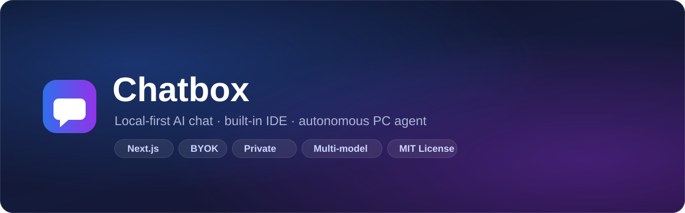

<div align="center">

**A local-first, multi-model AI workspace — chat, a built-in code IDE, and an autonomous PC agent — that runs entirely on your own machine.**

[](LICENSE)
[](#-how-to-download--run-it)
[](https://nextjs.org)
[](#-security-)
[](#-why-chatbox-)

</div>

---

## ✨ Features

- 🤖 **Multi-Model Chat** — OpenAI, Claude, Gemini, DeepSeek, Groq, Mistral, xAI, Cohere, OpenRouter, Ollama, LM Studio. Bring your own key (BYOK), stream replies live.
- 🧑‍💻 **Built-in IDE** — Monaco editor, file explorer, live terminal, git integration, and a project dashboard — all in the browser.
- 🚀 **Autonomous Coding Agent** — give it a big task and watch a live ✅ to-do checklist tick off as it plans, writes files, runs commands, and self-verifies.
- 🛡️ **PC Agent with Guardrails** — file/command access confined to your workspace, with an exec denylist, secret redaction, approval modes, and a full audit log.
- 🔒 **Local-first & Private** — binds to localhost (or your LAN only). Chats, keys, sessions, caches — everything stays inside one folder. Nothing touches the cloud.
- 📊 **Cost & Usage Tracking** — per-model tokens, USD/BDT cost, monthly budget warnings.
- 📦 **Portable Toolchain** — ships its own Node.js and Python. Copy the folder to any Windows PC and run.

## 🖼️ Screenshots

| 💬 Chat | ‍💻 IDE + Agent |
|:---:|:---:|
|  |  |

---

## 🤔 Why Chatbox?

- 🔐 **Privacy by default** — your API keys and conversations never leave your machine.
- 📦 **One folder, zero setup** — no installers; double-click a `.bat` and it runs.
- 🧱 **Security-first** — 5-layer defense-in-depth (network binding → origin/CSRF gates → server-side session auth → API guards → sandboxed PC bridge).
- 🛠️ **Real tooling** — not just a chat UI: an actual IDE + agent that edits files and runs code on your PC, with checkpoints for rollback.

---

## 🚀 How to Download & Run It

> 💡 You do **not** need to install Node, Python, Git, or anything else — the app bundles its own toolchain.

### 1️⃣ Download the code

**Option A — Git (recommended):**
```bash
git clone https://github.com/AtikShahriar01/chatbox.git
cd chatbox
```

**Option B — No Git?** On GitHub click the green **`<> Code` → Download ZIP**, unzip it anywhere (e.g. `D:\chatbox`).

### 2️⃣ Start the server — double-click one launcher

| 🖱️ File | What it does |
|---|---|
| **`start-app.bat`** | ✅ Daily use — server listens only on this PC (most secure) |
| **`start-server.bat`** | 📶 LAN mode — also open from your phone: `http://<your-PC-IP>:3000` |
| **`start-dev.bat`** |  Development with hot reload |

> ⏳ **First run takes a few minutes** — it auto-installs dependencies and builds the app. You'll see a console window; keep it open while using the app.
> 🛡️ If Windows Defender SmartScreen warns, click **"More info → Run anyway"** (it's your own local code).
> 🔥 If asked for Firewall access, allow it (only needed for LAN mode).

### 3️⃣ Open it in your browser

The launcher opens it automatically — or go to 👉 **http://localhost:3000**

### 4️⃣ Create your PIN 🔑

First visit shows a lock screen. Set a **4–8 digit PIN** (verified server-side; 5 wrong tries → 5-minute lock). This protects the app + your PC agent from anyone else on the network.

### 5️⃣ Add an AI key ⚙️

Open **Settings → Model Provider** and paste a key from any provider:

- 🌐 **OpenRouter** (one key, many models): get a free key at [openrouter.ai](https://openrouter.ai) → paste Base URL `https://openrouter.ai/api/v1` + your key
- 💙 **OpenAI / Claude / Gemini / DeepSeek** — paste their base URL + key
- 🖥️ **Ollama (free, fully local)** — install [ollama.com](https://ollama.com), run `ollama pull llama3.1`, set Base URL `http://localhost:11434/v1` — **no key needed**

### 6️⃣ Start chatting / coding 🎉

Type a question, or give the agent a big task like *"build a calculator app"* and watch the live ✅ task checklist tick off in the chat and the right-hand panel.

> 🛑 **To stop:** close the console window. **To update later:** `git pull` and re-run the launcher.

---

## 🔧 Configuration

### Model Provider
Set **API Base URL**, **API Key**, and **Model** in Settings → Model Provider. The app auto-detects the provider protocol (OpenAI / Anthropic / Google / Cohere / Ollama) from the base URL.

### PC Agent & Workspace
Open the IDE → **Change project folder** to pick the workspace. The agent can only read/write/run inside it. Permission modes (PC Access):
- 🔒 **Ask** — every write/command needs approval
- 🛡️ **Safe** — reads auto, writes/commands ask
- ⚡ **Full Access** — everything automatic (use with care)

### 📦 Portability
Every script self-locates — the folder works from any drive. To start fresh on a new machine, delete the `.auth/` folder (your PIN) and re-register.

---

## 📁 Project Structure

```
chatbox/
├── app/                # Next.js app — pages, API routes, components, lib
│   ├── app/            # routes: chat, ide, console, login + /api/*
│   ├── components/     # UI (ChatPanel, IDE, TodoPanel, …)
│   └── lib/            # state, providers, agent engine, security guard
├── agent-bridge/       # local PC bridge server (files, exec, git, terminals)
├── docs/               # security, audit, PRD/TRD/UIUX specs
├── .selftest/          # parser + live security test suites
├── scripts/            # check-env.sh
├── tools/  .home/      # bundled portable Node.js + Python (gitignored)
├── start-*.bat         # launchers
└── clean-cache.bat     # one-click cache/log cleanup
```

---

## 🔒 Security

Defense-in-depth — details in **[SECURITY.md](SECURITY.md)** and **[docs/SECURITY_AUDIT.md](docs/SECURITY_AUDIT.md)**.

- 🌐 **Network** — binds to localhost (LAN only in `start-server.bat`); Host allowlist blocks DNS rebinding.
- 🔑 **Auth** — server-side session (HttpOnly, SameSite=Strict, HMAC-signed cookie); PIN verified server-side.
- 🧯 **API** — same-origin + custom-header checks, per-route rate limits, body-size caps, strict bridge op-whitelist.
- 🖥️ **PC bridge** — token never reaches the browser; path confinement, credential denylist, output secret-redaction, full audit log.
- 🧼 **Content** — AI output is markdown-sanitized and locked down by a strict Content-Security-Policy.

---

## 🧪 Testing

```bash
node .selftest/parser-tests.mjs          # SSE parser unit tests
node .selftest/security-live-tests.mjs   # 25 live security tests (server + bridge running)
bash scripts/check-env.sh                # verify all data stays inside the folder
```

CI runs the build + parser tests on every push (`.github/workflows/ci.yml`).

---

## 🤝 Contributing

Issues and pull requests are welcome. For security-sensitive changes, follow
[docs/SECURITY-DIRECTIVE.md](docs/SECURITY-DIRECTIVE.md) and run the security test suite
before opening a PR.

---

## 📄 License

This project is licensed under the **MIT License** — see [LICENSE](LICENSE).

<div align="center">

⭐ *If you find Chatbox useful, consider starring the repo!*

</div>
