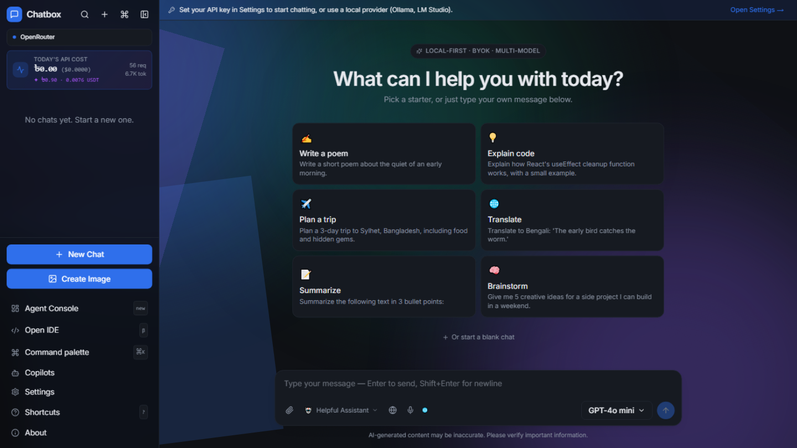
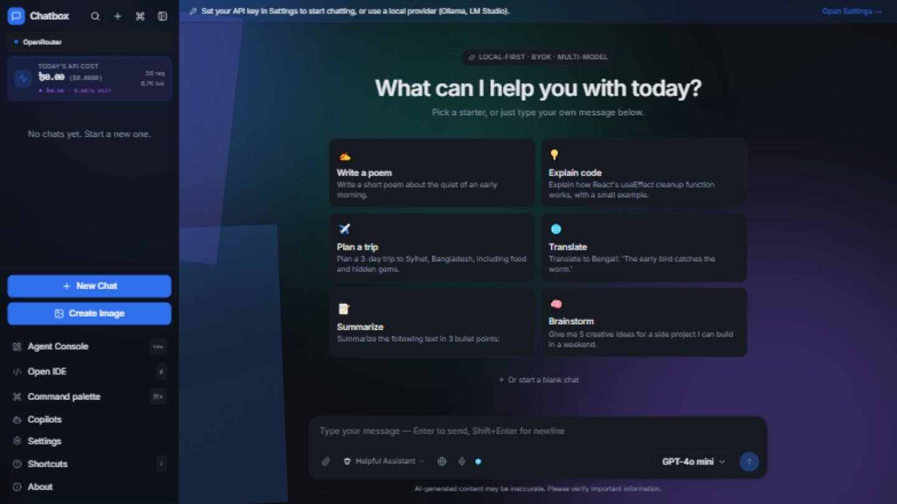
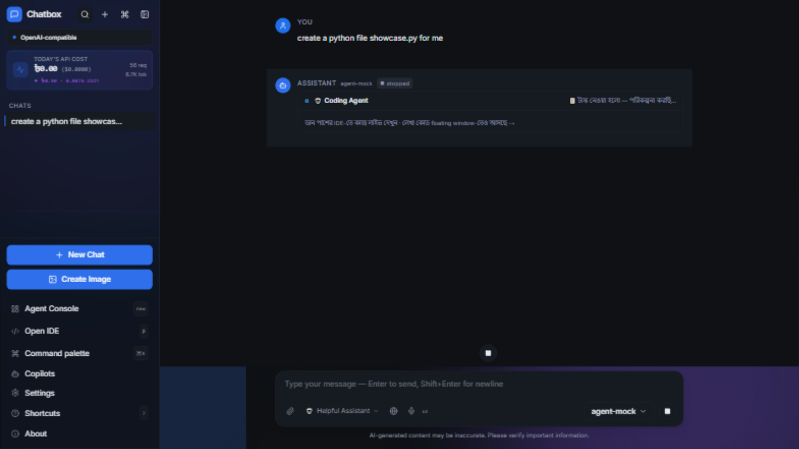

<p align="center">
  
</p>

<h1 align="center">💬 Chatbox</h1>

<p align="center">
  <strong>A Local-First, Multi-Model AI Chat Client with a Built-in IDE & Autonomous PC Agent</strong><br>
  <em>Bring your own key, chat with any model, write code in a real in-browser IDE, and let an agent act on your machine — 100% privately, on your own PC.</em>
</p>

<p align="center">
  <a href="#-quick-installation--run">
    
  </a>
  <a href="https://nextjs.org/">
    
  </a>
  <a href="LICENSE">
    
  </a>
</p>

<p align="center">
  
  
  
  
  
</p>

---

## 📖 Table of Contents
*   [🌟 Why Choose Chatbox?](#-why-choose-chatbox)
*   [🎨 Core User Interface Mockups](#-core-user-interface-mockups)
*   [🚀 Core & Advanced Features](#-core--advanced-features)
*   [⚙️ Technical Specifications](#️-technical-specifications)
*   [📊 Feature Comparison Matrix](#-feature-comparison-matrix)
*   [📥 Quick Installation & Run](#-quick-installation--run)
*   [🛡️ Security & Permission Model](#️-security--permission-model)
*   [⌨️ Keyboard Shortcuts (কীবোর্ড শর্টকাট)](#️-keyboard-shortcuts-কীবোর্ড-শর্টকাট)
*   [💻 System Requirements (সিস্টেমের প্রয়োজনীয়তা)](#-system-requirements-সিস্টেমের-প্রয়োজনীয়তা)
*   [❓ Frequently Asked Questions (FAQ)](#-frequently-asked-questions-faq)
*   [🤝 Contribution Guidelines](#-contribution-guidelines)
*   [📧 Contact & Support](#-contact--support)

---

## 🌟 Why Choose Chatbox?

Most AI chat apps are thin wrappers around a single cloud account — your prompts, keys, and history live on someone else's server. **Chatbox is different.** It is a self-contained, local-first workspace that runs entirely on your own PC: the server binds to `localhost`, your API keys never leave your browser, and every cache, session, and chat stays inside a single folder.

Unlike public chat apps, Chatbox also ships a **real code editor, a live terminal, and an autonomous coding agent** that can actually edit files and run commands on your machine — with strict guardrails, approval modes, and a full audit trail. One folder, zero installers, total privacy.

---

## 🎨 Core User Interface Mockups

A visual tour of the premium dark-themed interfaces built into Chatbox:

<table width="100%">
  <tr>
    <td width="50%" align="center">
      <strong>💬 Multi-Model Chat</strong><br>
      <br>
      <em>Streaming replies, BYOK, cost badges.</em>
    </td>
    <td width="50%" align="center">
      <strong>🧑‍💻 Built-in IDE</strong><br>
      <br>
      <em>Monaco editor, file tree, live terminal.</em>
    </td>
  </tr>
  <tr>
    <td width="50%" align="center">
      <strong>📊 Agent Console</strong><br>
      <br>
      <em>Tasks, usage, security & audit views.</em>
    </td>
    <td width="50%" align="center">
      <strong>🚀 Autonomous Agent</strong><br>
      <br>
      <em>Live to-do checklist ticking in real time.</em>
    </td>
  </tr>
</table>

---

## 🚀 Core & Advanced Features

### 💬 Chat & Models
*   **Bring Your Own Key (BYOK):** OpenAI, Claude, Google Gemini, DeepSeek, Groq, Mistral, xAI, Cohere, OpenRouter — and local **Ollama / LM Studio** with no key at all.
*   **Smart Provider Detection:** The app auto-detects the provider protocol from your base URL and streams replies correctly (OpenAI / Anthropic / Google / Cohere native).
*   **Copilots & Personas:** Switch system-prompt personalities (Coder, Writer, Translator, Analyst) per chat.
*   **Web Search Mode:** Ground answers in live results with inline citations.

### 🧑‍ Integrated IDE
<details>
<summary><b>🔍 Expand: Editor, Terminal & Git</b></summary>
<br>

*   **Monaco Editor** (the VS Code engine) with syntax highlighting, local assets, and full offline support.
*   **Live Terminal** — real shell sessions streamed over SSE, CMD or PowerShell.
*   **Git Panel** — status, diff, stage, commit, branches, and rollback checkpoints.
*   **File Explorer** — create/rename/delete files inside your workspace with confirmation.
</details>

### 🤖 Autonomous Coding Agent
<details>
<summary><b>🔍 Expand: Live To-Do Checklist & Self-Verification</b></summary>
<br>

*   **Live To-Do Panel:** For any big task the agent publishes a 3–8 step checklist that ticks off in real time — in the chat bubble and a floating right-hand panel.
*   **Mandatory Code Loop:** The agent writes code, runs it, reads the output, fixes errors, and re-runs until it verifies — it cannot claim "done" without a successful run.
*   **Native Tool Calling + Text-Protocol Fallback:** Works across providers with or without function-calling support.
</details>

### 📊 Usage & Cost
<details>
<summary><b>🔍 Expand: Tokens, USD/BDT & Budget</b></summary>
<br>

*   **Per-Model Token Tracking** with prompt/completion/reasoning/cached breakdown.
*   **Dual-Currency Cost** (USD + BDT) and an internal "Usage Value" reference.
*   **Monthly Budget Warnings** at 80% and 100%.
</details>

---

## ⚙️ Technical Specifications

| Layer | Technology |
| :--- | :--- |
| **Frontend / Server** | Next.js 14 (App Router), React 18, Zustand, Tailwind CSS |
| **Editor** | Monaco (local, offline) |
| **Terminal** | xterm.js + SSE streaming |
| **AI Routing** | Multi-provider adapters (OpenAI / Anthropic / Google / Cohere / Ollama) |
| **PC Bridge** | Node.js HTTP server (localhost:8765), token-authenticated |
| **Runtime** | Bundled portable Node.js + Python (no system install needed) |
| **Security** | Host/Origin gates, HMAC session cookies (scrypt PIN + token rotation), CSP, rate limits, op whitelist, exec denylist, provider-URL SSRF guard, symlink-safe path confinement, audit log |
| **Testing** | §20 pyramid: unit · parser · integration · security-live · security-deep · e2e — **172 checks** via `node .selftest/run-all.mjs` |

---

## 📊 Feature Comparison Matrix

| Feature | **Chatbox** | ChatGPT Desktop | Claude Desktop | Generic Web Chat |
| :--- | :---: | :---: | :---: | :---: |
| **Fully local / self-hosted** | ✅ | ❌ | ❌ | ❌ |
| **Bring your own key (any provider)** | ✅ | ❌ | ❌ | ⚠️ Single |
| **Built-in code IDE + terminal** | ✅ | ❌ | ❌ | ❌ |
| **Autonomous agent that edits & runs on your PC** | ✅ | ⚠️ Limited | ⚠️ Limited | ❌ |
| **Free local models (Ollama)** | ✅ | ❌ | ❌ | ❌ |
| **5-layer security + audit log** | ✅ | ❌ | ❌ | ❌ |
| **Cost / usage tracking (USD + BDT)** | ✅ | ❌ | ❌ | ❌ |
| **Price** | Free (MIT) | Subscription | Subscription | Varies |

---

## 📥 Quick Installation & Run

> 💡 You do **not** need to install Node, Python, or Git — the app bundles its own toolchain.

### 1. Download the Code

```bash
git clone https://github.com/AtikShahriar01/chatbox.git
cd chatbox
```
*(No Git? On GitHub click **`<> Code → Download ZIP`** and unzip.)*

### 2. Launch the Server

Double-click one launcher:

| 🖱️ File | What it does |
|---|---|
| **`start-app.bat`** | ✅ Daily use — localhost only (most secure) |
| **`start-server.bat`** | 📶 LAN mode — also open from your phone via `http://<PC-IP>:3000` |
| **`start-dev.bat`** | 🛠️ Development with hot reload |

> ⏳ First run auto-installs dependencies and builds the production bundle. Keep the console window open while using it.

### 3. Open, Set a PIN, Add a Key

1. Go to **http://localhost:3000** (the launcher opens it).
2. 🔑 Create a **4–8 digit PIN** (server-side verified; 5 wrong tries → 5-min lock).
3. ⚙️ **Settings → Model Provider** → paste an API key (or point at local Ollama `http://localhost:11434/v1` — no key needed).
4. 🎉 Chat, or give the agent a big task and watch the ✅ checklist tick.

> 🔄 **Update:** `git pull` then re-run the launcher. **🛑 Stop:** close the console window.

---

## 🛡️ Security & Permission Model

Chatbox uses **defense-in-depth** — five independent layers plus a layered regression-test pyramid (full write-ups: [docs/SECURITY.md](docs/SECURITY.md), [docs/SECURITY_AUDIT.md](docs/SECURITY_AUDIT.md), [docs/TESTING.md](docs/TESTING.md)):

1. 🌐 **Network** — server binds to localhost (LAN only in `start-server.bat`); Host allowlist blocks DNS rebinding.
2. 🔑 **Auth** — server-side session (HttpOnly, SameSite=Strict, HMAC-signed cookie); PIN verified server-side with scrypt; token-version rotation powers logout-all / change-PIN revocation; 5-strike brute-force lockout.
3. 🧯 **API** — same-origin + custom-header checks, per-route rate limits, body-size caps, strict bridge op-whitelist.
4. 🖥️ **PC bridge** — token never reaches the browser; **symlink-safe** path confinement (a junction inside the workspace cannot smuggle ops out), credential exec-denylist, output secret-redaction, append-only audit log.
5. 🧼 **Content** — AI output is markdown-sanitized under a strict CSP; provider base-URLs pass a SSRF guard (cloud-metadata + IPv4-mapped-IPv6 forms rejected — your local Ollama stays allowed).

🧪 **§20 Test pyramid** — every layer above is pinned by `node .selftest/run-all.mjs`: 172 checks across unit, SSE-parser, integration, two security batteries (forged-cookie auth bypass, SSRF, path traversal, symlink escape, command injection, CSRF incl. raw-socket Host rebinding, XSS headers, rate-limit bypass) and E2E journeys with a full live agent workflow. CI runs the offline half on every push.

**Agent permission modes:** 🔒 *Ask* (every action needs approval) · 🛡️ *Safe* (reads auto) · ⚡ *Full Access* (automatic, use with care).

---

## ⌨️ Keyboard Shortcuts (কীবোর্ড শর্টকাট)

| Command | Shortcut | Action |
| :--- | :---: | :---: |
| **Command Palette** | `Ctrl + K` | Open the command palette |
| **New Chat** | `Ctrl + N` | Start a fresh conversation |
| **Toggle Explorer** | `Ctrl + B` | Show/hide the file tree |
| **Toggle Terminal** | `` Ctrl + ` `` | Show/hide the terminal |
| **Save File** | `Ctrl + S` | Save the active editor tab |
| **Global Search** | `Ctrl + Shift + F` | Search across the workspace |
| **Run Agent Task** | `Ctrl + Enter` | Run the agent from the console input |

---

## 💻 System Requirements (সিস্টেমের প্রয়োজনীয়তা)

*   **Operating System:** Windows 10 or 11 (64-bit).
*   **Processor:** Intel Core i3 / AMD Ryzen 3 or higher.
*   **Memory:** 4 GB RAM minimum (8 GB recommended for the IDE + agent).
*   **Storage:** ~1.5 GB (bundled Node.js + Python toolchain included).
*   **Network:** None required for local models (Ollama); internet only for cloud providers.

---

## ❓ Frequently Asked Questions (FAQ)

<details>
<summary><b>1. Does my data or API key leave my computer?</b></summary>
No. The server binds to localhost, keys live only in your browser, and chats/sessions/caches stay inside the folder. Keys are sent only to the AI provider you choose.
</details>

<details>
<summary><b>2. Do I need to pay for an AI model?</b></summary>
You can run 100% free and offline with <b>Ollama</b> (local models). For the strongest models, bring your own key from OpenAI, Claude, Gemini, etc. — you pay that provider directly.
</details>

<details>
<summary><b>3. Can the agent damage my PC?</b></summary>
The agent is confined to your chosen workspace, has a credential denylist, redacts secrets, logs every action, and supports Ask/Safe approval modes. Delete confirmation and checkpoints for rollback are built in.
</details>

<details>
<summary><b>4. Can I move the folder to another PC or drive?</b></summary>
Yes — every script self-locates, so it works from any drive. Delete <code>.auth/</code> to start fresh with a new PIN.
</details>

---

## 🤝 Contribution Guidelines

Contributions are welcome! Please:
1. Fork the repository and create a feature branch.
2. Run the test pyramid: `node .selftest/run-all.mjs` (with app + bridge running), or the offline half with `node .selftest/run-all.mjs --offline`. Coverage map: [docs/TESTING.md](docs/TESTING.md).
3. Follow the security policy in [docs/SECURITY-DIRECTIVE.md](docs/SECURITY-DIRECTIVE.md).
4. Open a pull request with a clear description.

---

## 📧 Contact & Support

<p align="center">
  <a href="https://github.com/AtikShahriar01">
    
  </a>
  <a href="https://github.com/AtikShahriar01/chatbox/issues">
    
  </a>
</p>

---

<div align="center">

**⭐ If you find Chatbox useful, consider starring the repo!**

Made with 💙 by **AtikShahriar01** · Licensed under [MIT](LICENSE)

</div>
